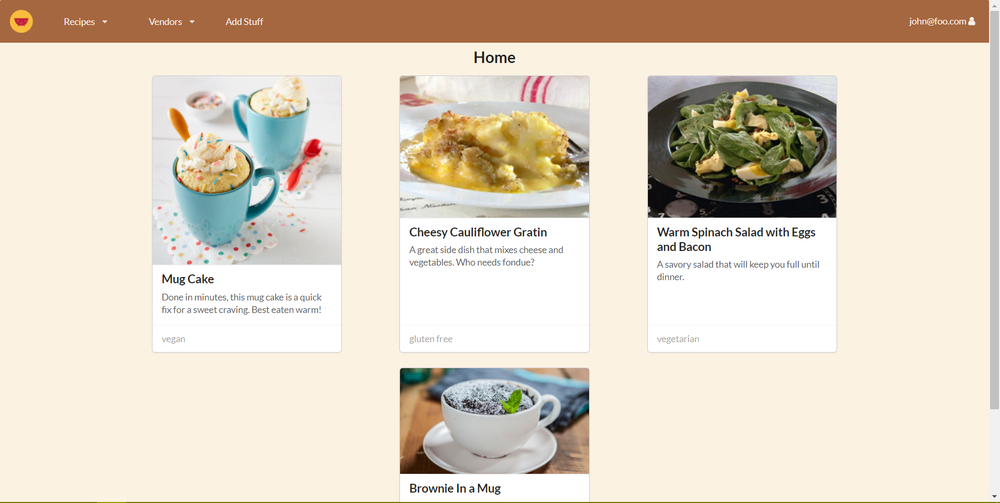

# Table of Contents

* [About Constrained Cooking](#about-constrained-cooking)
  * [View the System](#view-the-system)
  * [Installation](#installation)
* [Development History](#development-history)
  * [Milestone 1: Mockup Development](#milestone-1-mockup-development)
  * [Milestone 2: Add Functionality](#milestone-2-add-functionality)
* [About the Team](#about-the-team)

# About Constrained Cooking

Constrained Cooking is a Meteor application that creates a way for students to share creative recipes tailored to limited kitchen resources, limited ingredients, and limited time.  We have several goals for this app, but our focus will be on allowing users to browse and upload recipes.  The system will have a search function where students can find recipes according to dietary restrictions and other useful tags.  Each recipe will have an estimated cost per serving and cook time.

The application also has a vendor system, where local food vendors can establish a profile.  Vendors can list their produce or items along with a price for each item.  A recipe page will then direct a user to vendors who sell each ingredient for their dish.  Vendors will have a profile page to show their location and hours.  Lastly, the app has an admin role.  These administrators can edit all content in the system or remove inappropriate content.

## View the System

Below are some screenshots of the current running application:


The application brings the user to a landing page where they can see the theme of the application.  It has general information to draw in students and vendors.  We created the graphics with college students in mind; they are simple, colorful, images that are eye-catching, but not overbearing.



After a user creates an account, they can create recipes using the add recipe page:


## Installation

To install Constrained Cooking, first [install Meteor](https://www.meteor.com/install).

Next, [download a copy of Constrained Cooking](https://github.com/constrainedcooking/constrainedcooking.git), or clone it to your desktop.

Third, cd into the app/ directory and install libraries with:

```
$ meteor npm install
```

Fourth, run the system with:

```
$ meteor npm run start
```

Find the application at [http://localhost:3000](http://localhost:3000).

# Development History

Development of Constrained Cooking followed practices of [Issue Driven Project Management](http://courses.ics.hawaii.edu/ics314s18/modules/project-management/).  Milestones are used to track the progress on groups of issues; they consist of tasks that take 2-3 days.  To manage progress within a Milestone, GitHub projects are created with three columns corresponding to: Backlog, In Progress, and Done.

## [Milestone 1: Mockup Development](https://github.com/constrainedcooking/constrainedcooking/projects/1)

This milestone started on April 2, 2018 and ended on April 12, 2018.

The goal of Milestone 1 was to create mockup pages of what we expect the final system to look like and implement the basics in Meteor.  Below are layouts our team sketched of several page ideas.


Recipe Home Page


Add Recipe Page


Vendor Stock Page


Profile Page

Later we implemented some of these pages in Meteor.  We did not implement databases yet, so the recipe cards and user pages are currently hardcoded.

The first page we completed was the [landing page](http://constrainedcooking.meteorapp.com/#/).  We used Photoshop to create the Constrained Cooking title, and found vector icons to add to our website descriptions.  We plan on adding more to the landing page later such as linking icons to certain pages and maybe having a running feed of new recipes.


Next, we implemented the recipe [home page](http://constrainedcooking.meteorapp.com/#/list).  This shows the recipes as cards with large pictures, descriptions, and tags at the bottom.  The recipes displayed are currently hard coded.  We also plan on turning the tag section into active buttons so a user can click them and filter by tags.


The system also has a vendor role.  The page below shows how they can fill a form to [add an ingredient](http://constrainedcooking.meteorapp.com/#/addvendoritem) that they sell along with viewing a [list](http://constrainedcooking.meteorapp.com/#/listvendor) of items they have.


Lastly, we also implemented a view [profile page](http://constrainedcooking.meteorapp.com/#/profileview).  This shows general information of the person's account.  It's currently in a card format, but we plan on changing it into a larger diaply which has a person's general information, along with dietary habits, and favorited recipes.

## [Milestone 2: Add Functionality](https://github.com/constrainedcooking/constrainedcooking/projects/2)

This milestone started on April 12, 2018 and ended on April 24, 2018.  The goal of this milestone was to improve functionality of the site.  This included implementing databases rather than using hardcoded items such as recipes, users, and tags.


# About the Team

Our team is comprised of Aidan Akamine, Collin Takasaki, Cristina McLaughlin, and Brandon Kang.

Aidan plans to assist in database management and page implementation.

Collin plans to contribute his coding and culinary skills.

Cristina plans to help with design and layout.  Tweaking colors, finding pictures, and fixing padding and margins are some of her favorite things to do.

Brandon ...
