# Table of Contents

* [About Constrained Cooking](#about-constrained-cooking)
  * [View the System](#view-the-system)
  * [Community Feedback](#community-feedback)
* [Developer Guide](#developer-guide)
  * [Installation](#installation)
  * [Modifying the System](#modifying-the-system)
* [Development History](#development-history)
  * [Milestone 1: Mockup Development](#milestone-1-mockup-development)
  * [Milestone 2: Add Functionality](#milestone-2-add-functionality)
* [About the Team](#about-the-team)

# About Constrained Cooking

If you've ever dormed or attended college away from home, you'd know that cooking and college students are like oil and water.  They just don't mix.  Sometimes it's limited kitchen access, limited time, limited resources, or limited knowledge of how to actually cook; but it boils down to students often taking a much unhealthier option of takeout or preprocessed foods.

Constrained Cooking is a Meteor application that creates a way for students to share creative recipes tailored to the limitations of a normal college student.  We have several goals for this app, but our focus will be on allowing users to browse and upload recipes.  The system will have a search function where students can find recipes according to dietary restrictions and other useful tags.  Each recipe will have an estimated cost per serving and cook time.

The application also has a vendor system, where local food vendors can establish a profile.  Vendors can list their produce or items along with a price for each item.  A recipe page will then direct a user to vendors who sell each ingredient for their dish.  Vendors will have a profile page to show their location and hours.  Lastly, the app has an admin role.  These administrators can edit all content in the system or remove inappropriate content.

Constrained Cooking intends to solve the issue of cooking access for the UH community by making it easier for students to locate recipes and ingredients.

## View the System

Below are some screenshots of the current running application:

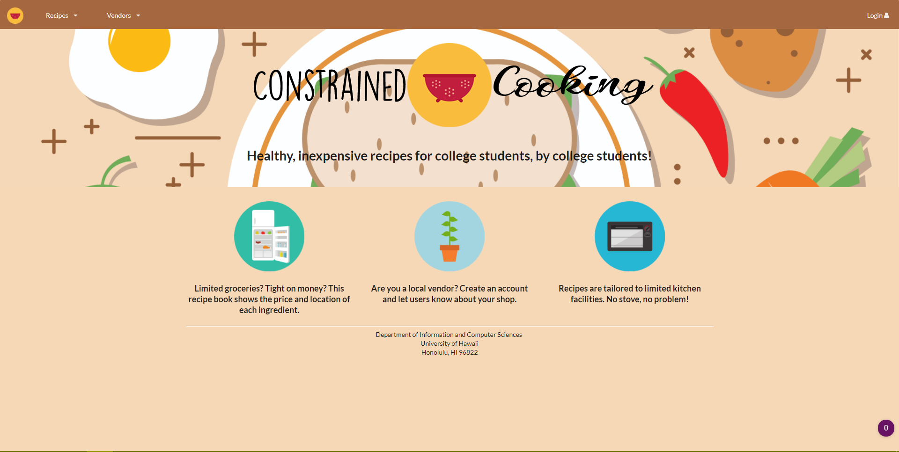

User's are immediately brought to a landing page where they can see the theme of the application.  It has general information for prospective users.  We created the graphics with college students in mind; they are simple, colorful, images that are eye-catching, but not overbearing.

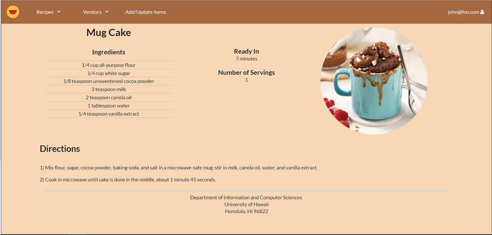

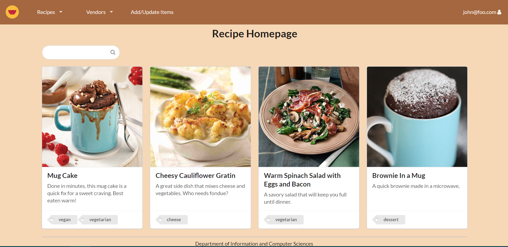

Users can then view the Recipe Homepage.  They do not need to create an account to scroll through the homepage.  However, they can create an account to access more content.  If they find a recipe they want to view, they can click on the card which takes them to the full recipe after logging in.

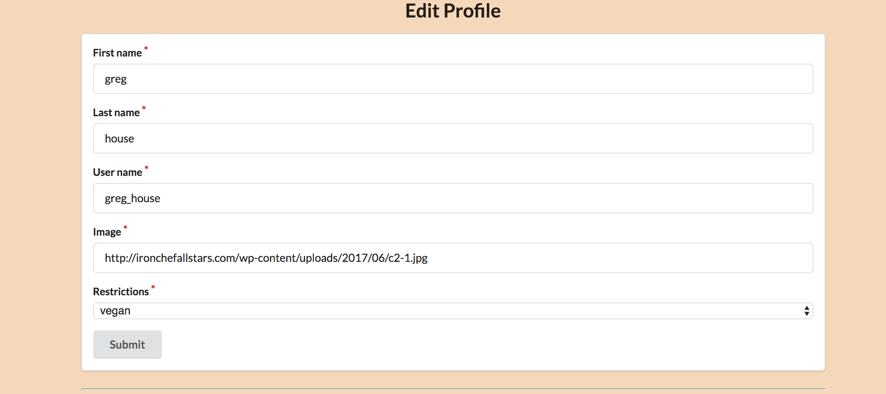

After logging in a user can view and edit their profile page.  They can modify their image along with dietary habits.

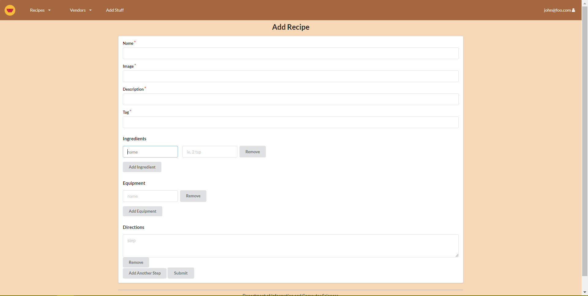

After being logged in, the user can also contribute their own recipes on the add recipe page.  They can fill out the form and press submit.


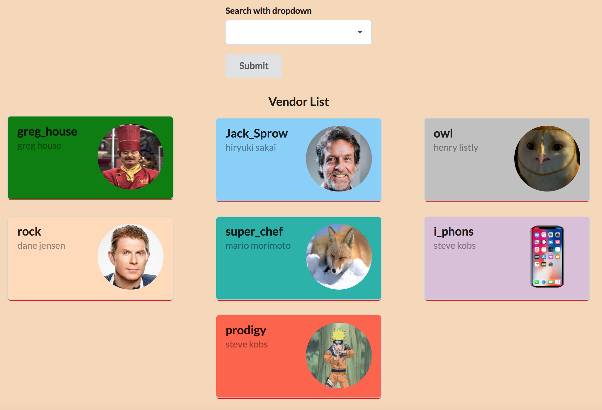
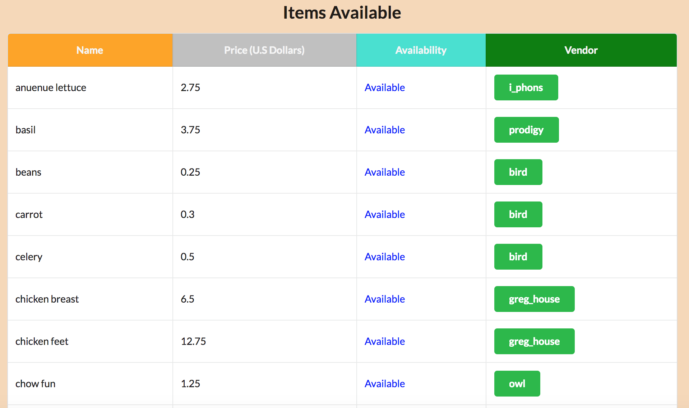
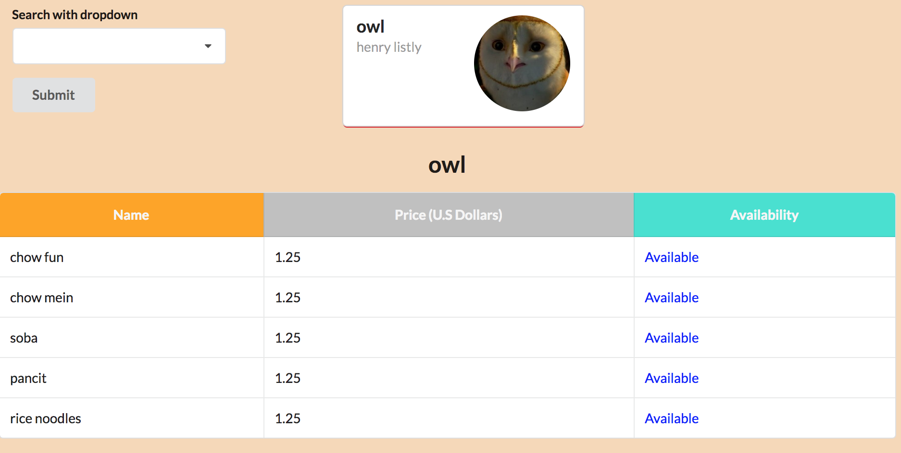

Users can search through a list of vendors to see items sold on a vendor to vendor basis or look at all items as a whole.

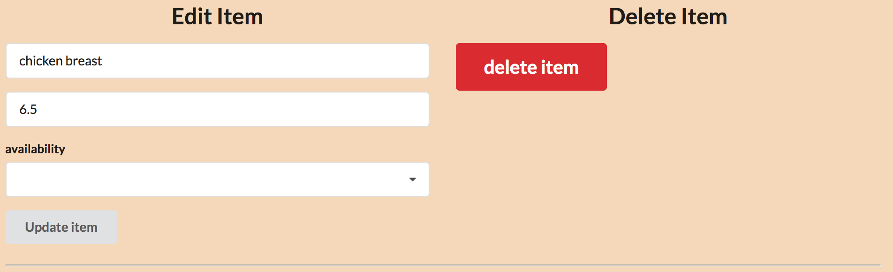
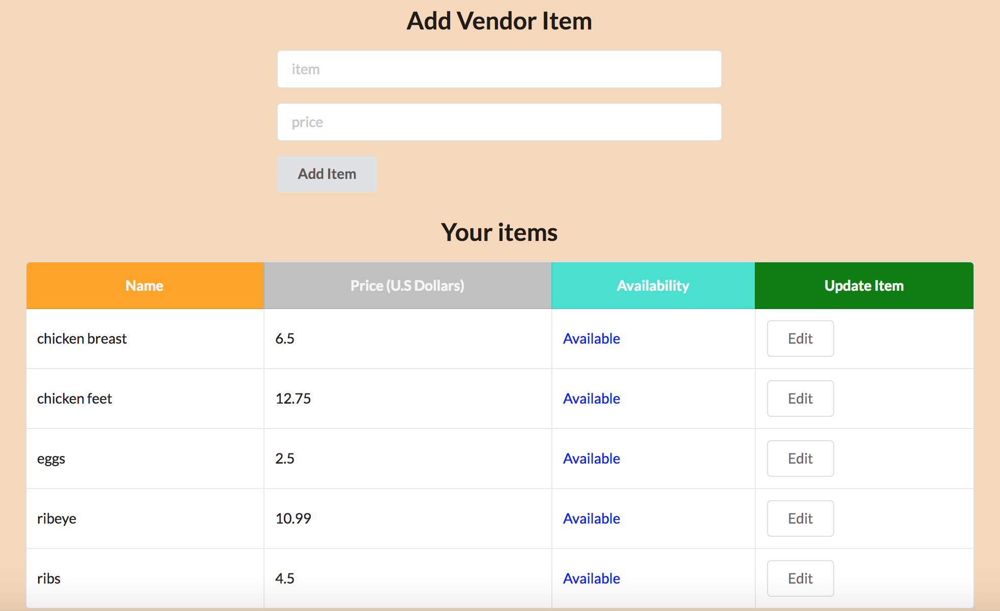

When a vendor is using the website, they can edit their current stock in the vendor homepage.  Here they can add items along with prices per unit.

Administrators can also view vendors and users that frequent the site.

## Community Feedback

#### Noah (Student who dorms)

> I'd use this to find recipes, but I wouldn't contribute anything.

He didn't really feel like the website was helpful because he doesn't have a fridge or a microwave in his dorm so he can't cook anything.  When he actually tested the application he thought it was "cute", he liked the recipe cards because the pictures were eyecatching.  He thought the add recipe page was tedious and people wouldn't be willing to contribute to the system unless there was a "gamification" experience.

#### Mayce (Student who dorms)

Although she liked the visual appeal of the website, she truthfully said that she probably would not use the website very often. Since she dorms at UH, she is obligated to purchase a meal plan and thus doesn't have too much of a need to craft her own meals. One thing she did like about the application however, was the idea of having local farmers and distributors being able to have an online presence on the site. She liked the idea of the website being another place to promote eating local.

#### Kazu-umi (Student who commutes)
> The add recipie page was quite intuitive

She like the intuitive way recipes can be added onto the website. She also thought the way vendors were presented was interesting. 

#### Robert (Works at UH)
>Cool site.

He said that since he sometimes purchases produce from the vendors near the atm’s at campus center, the site could be potentially very useful to him. After trying the site out, he said that the homepage was very fitting for the website and that the navigation bar was intuitive and easy to use. 

#### Emily(Engineer at Nan, Inc) 
>I like the search bar!

Emily said that, while she doesn't plan on using the website very often, she liked the search bar. She thought it was a nice touch to more easily navigate around recipes.

# Developer Guide

## Installation

To install Constrained Cooking, first [install Meteor](https://www.meteor.com/install).

Next, [download a copy of Constrained Cooking](https://github.com/constrainedcooking/constrainedcooking.git), or clone it to your desktop.

Third, cd into the app/ directory and install libraries with:

```
$ meteor npm install
```

Fourth, run the system with:

```
$ meteor npm run start
```

Find the application at [http://localhost:3000](http://localhost:3000).

## Modifying the System

The top-level directory structure contains:

```
app/        # holds the Meteor application sources
config/     # holds configuration files, such as settings.development.json and proeduction.development.json
.gitignore  # don't commit IntelliJ project files, node_modules, and settings.production.json
```

# Development History

Development of Constrained Cooking followed practices of [Issue Driven Project Management](http://courses.ics.hawaii.edu/ics314s18/modules/project-management/).  Milestones are used to track the progress on groups of issues; they consist of tasks that take 2-3 days.  To manage progress within a Milestone, GitHub projects are created with three columns corresponding to: Backlog, In Progress, and Done.

## [Milestone 3: Added more features](https://github.com/constrainedcooking/constrainedcooking/projects/3)
This milestone started on April 24, 2018 and ended on May 4, 2018. Milestone 3 builds heavily from milestone 2 and adds more features to the base functionality created in milestone 2. The goal of milestone 3 was to improve capabilities as well as increase the amount of features in the website. In addition we also made the website as a whole more visually appealing and hopefully intuitive to use. Finally we increased the functionality of the main focus points of the website, these being the recipies and vendor sections. 

For the vendor section:

 * Viewers of the site can now not only view recipies but also a full list of items solds by vendors

 * Viewers of the site can look at a list of vendors to view the specific items sold by a vendor

 * Vendors can update, add and delete items they sell or do not sell anymore
 
For the recipes section:
 
  * Users can use the search bar to find a recipe they want, and click on the link to redirect to the viewing page
  
  * The recipe pages were reformatted, and default recipes were filled in

Overall Milestone 3 represents the first full version of this website. We present a funcitonal, appealing and hopefully easy to use website for the cooking needs of students at UH Manoa.

## [Milestone 2: Add Functionality](https://github.com/constrainedcooking/constrainedcooking/projects/2)

This milestone started on April 12, 2018 and ended on April 24, 2018.  The goal of this milestone was to improve functionality of the site.  This included implementing databases rather than using hardcoded items such as recipes, users, and tags.

## [Milestone 1: Mockup Development](https://github.com/constrainedcooking/constrainedcooking/projects/1)

This milestone started on April 2, 2018 and ended on April 12, 2018.

The goal of Milestone 1 was to create mockup pages of what we expect the final system to look like and implement the basics in Meteor.  Below are layouts our team sketched of several page ideas.

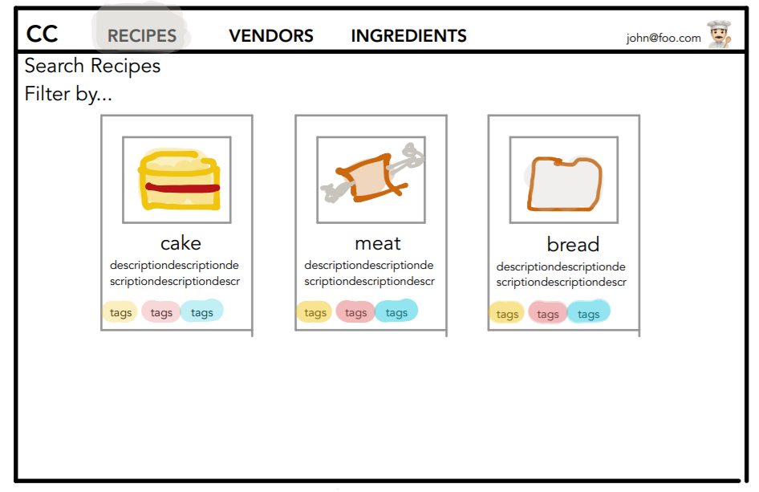

Recipe Home Page

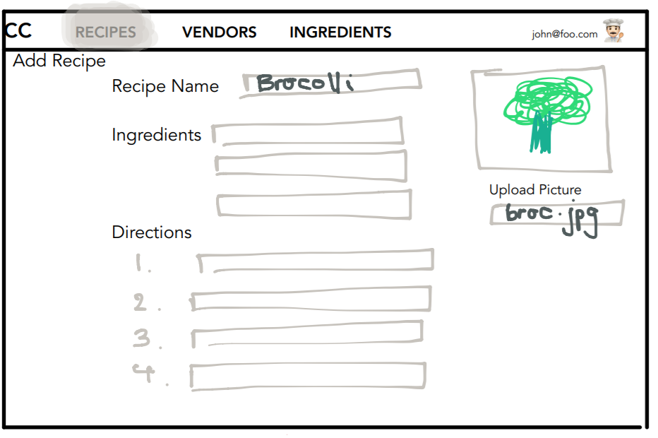

Add Recipe Page

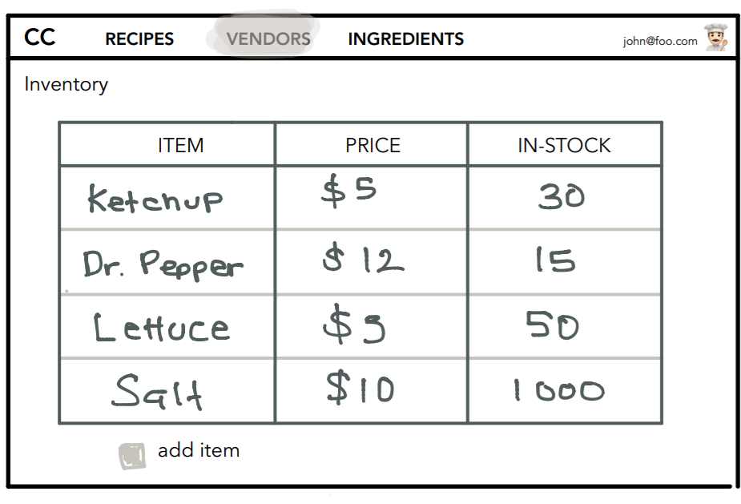

Vendor Stock Page

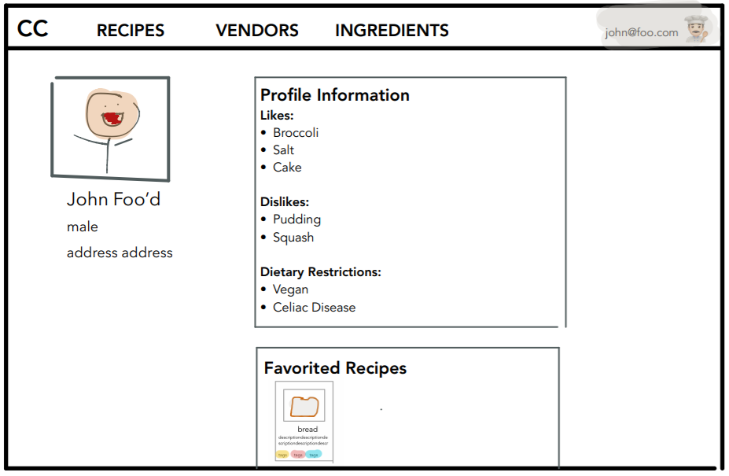

Profile Page

Later we implemented some of these pages in Meteor.  We did not implement databases yet, so the recipe cards and user pages are currently hardcoded.

The first page we completed was the [landing page](http://constrainedcooking.meteorapp.com/#/).  We used Photoshop to create the Constrained Cooking title, and found vector icons to add to our website descriptions.  We plan on adding more to the landing page later such as linking icons to certain pages and maybe having a running feed of new recipes.

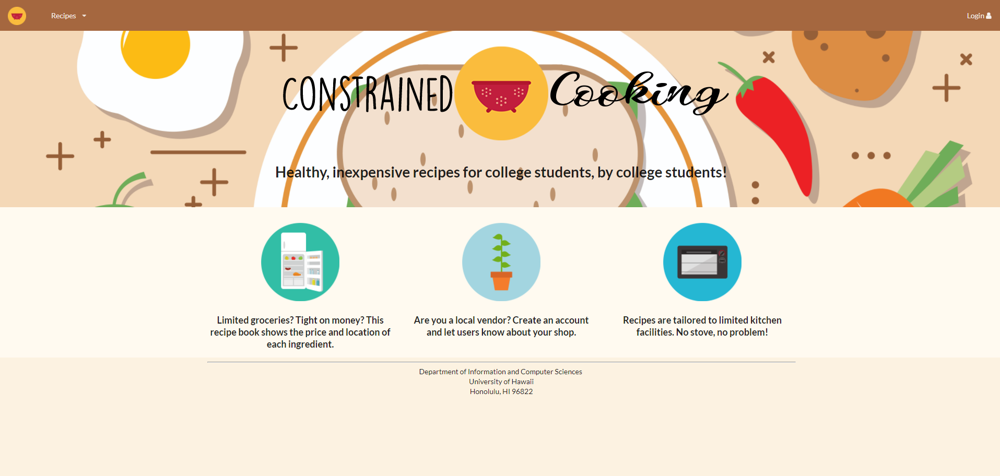

Next, we implemented the recipe [home page](http://constrainedcooking.meteorapp.com/#/list).  This shows the recipes as cards with large pictures, descriptions, and tags at the bottom.  The recipes displayed are currently hard coded.  We also plan on turning the tag section into active buttons so a user can click them and filter by tags.

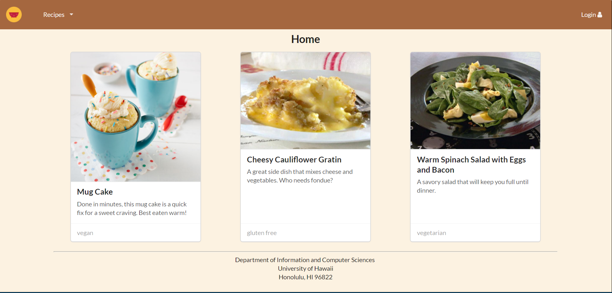

The system also has a vendor role.  The page below shows how they can fill a form to [add an ingredient](http://constrainedcooking.meteorapp.com/#/addvendoritem) that they sell along with viewing a [list](http://constrainedcooking.meteorapp.com/#/listvendor) of items they have.

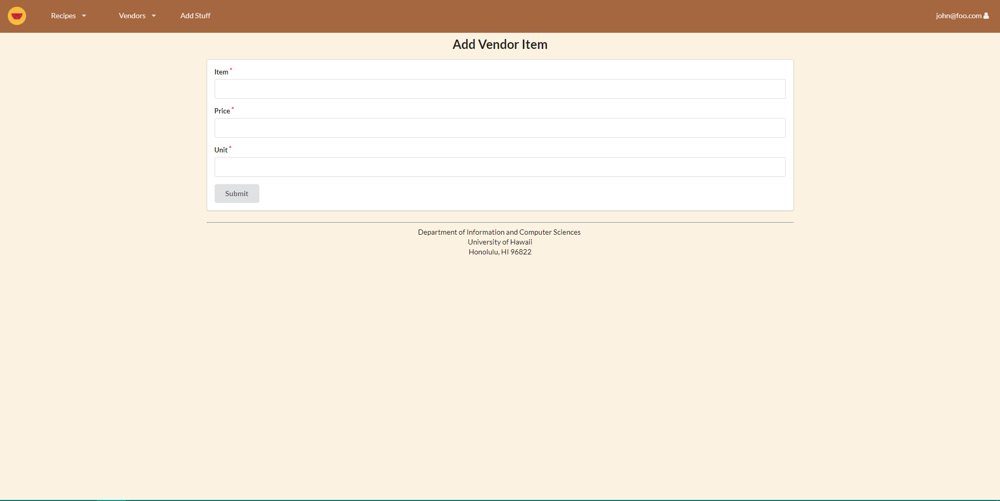

Lastly, we also implemented a view [profile page](http://constrainedcooking.meteorapp.com/#/profileview).  This shows general information of the person's account.  It's currently in a card format, but we plan on changing it into a larger diaply which has a person's general information, along with dietary habits, and favorited recipes.

# About the Team

Our team is comprised of Aidan Akamine, Collin Takasaki, Cristina McLaughlin, and Brandon Kang.

Aidan plans to assist in database management and page implementation.

Collin plans to contribute his coding and culinary skills.

Cristina plans to help with design and layout.  Tweaking colors, finding pictures, and fixing padding and margins are some of her favorite things to do.

Brandon ...
